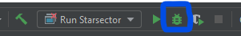
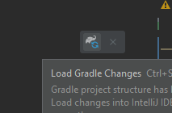

# Starsector Mod Template using Gradle and IntelliJ

v1.2.0

## Description

This is a template for a generic Starsector mod using Java.

There is a video walkthrough to set it up here: https://www.youtube.com/watch?v=q63p67f-F8k.

Simply download it as a `.zip`, clone it using `git clone https://github.com/davidwhitman/starsector-mod-template.git`, or click ["Use this template"](https://github.com/davidwhitman/starsector-mod-template/generate) and then follow the instructions below.

When you are done, you will have a mod that does nothing, but is ready for anything to be added.

Written for IntelliJ Community ([free download](https://www.jetbrains.com/idea/download)), but should work with any IDE. Latest version of IntelliJ is 2021.2 as of writing.

## Features

- A one-click command to build your mod and launch Starsector with full breakpoint debugging.
- Automatically generated `mod_info.json` and Version Checker files.
  - Set your mod's version once in `build.gradle.kts` and both files will be updated.
- A new GitHub Release will be created automatically whenever a git tag is pushed, if the mod is hosted on GitHub.
  - Delete the `.github` folder to disable this.
- Gradle build system, works with any IDE (but you don't need to know what Gradle is).

## Initial Setup Checklist

(or follow along with [this video tutorial](https://www.youtube.com/watch?v=q63p67f-F8k))

### Step 1

Choose whether you wish to manually update the `mod_info.json` and Version Checker files (manual updating is the default option) or have it done automatically (requires slightly more setup).

#### First do these, then choose Option A or Option B

- [ ] In `build.gradle.kts` `SECTION A`, set the `modName` variable.
- [ ] In `build.gradle.kts` `SECTION A`, check `starsectorDirectory` for correctness. It will need to be updated if you've installed the game to a non-default location or aren't on Windows.

#### Option A (recommended): I will manually update my `mod_info.json` and Version Checker files

- [ ] Go and update the `mod_info.json` and Version Checker (if you are supporting Version Checker) files by hand

#### Option B: Automatically update my `mod_info.json` and Version Checker files from a single config file

- [ ] In `build.gradle.kts` `SECTION B`, set `shouldAutomaticallyCreateMetadataFiles` to `true`, then set the rest of the variables in `SECTION B`. Whenever you would normally manually update `mod_info.json` or Version Checker, update these values in `SECTION B` instead and, upon mod recompile, they will be updated.

### Step 2

#### Option 1: If starting a brand-new project

- [ ] Change the package from the template default. In IntelliJ, open up `ExampleEveryFrameScript`,
  right-click on the first line in the file (`package com.example;`) and go to `Refactor - Rename`. From there, you may
  rename `com.example` to anything lowercase you like (e.g. "wisp.perseanchronicles"). If it pops up a refactoring preview, keep everything selected and
  click `Do Refactor`.
  - You will put any new code you write into the `src/com/example` directory (or `src/wisp/perseanchronicles` or whatever you named it in the previous step).
- Any other assets, such as `graphics` or `data`, can go directly into the top-level folder (next to, but not inside, `src`).

#### Option 2: If importing existing code

- [ ] Copy the code you want to use into the `src` directory.
  - For example, if your code was in a folder structure like `data/scripts` (the .java files would start with a line like `package data.scripts;`), then the new folder structure would be `src/data/scripts`.
  - If in doubt, look at the package name at the top of a `.java` file, then look for that folder. For example, Nexerelin has a file that starts with `package exerelin;`, so we look inside Nexerelin's `jars/src.zip` and find `sources/ExerelinCore/exerelin`. We copy only the `exerelin` folder into our template's `src` folder so that the `.java` file's location relative to `src` perfectly matches the package.
  - The `main` folder in `src` can be ignored. It would be used for new projects, but is not needed for importing.
- [ ] Any other assets, such as `graphics` or `data`, can go directly into the top-level folder (next to, but not inside, `src`).

### Optional

- In `settings.gradle`, change `rootProject.name = 'template'` to be your new name instead.
  - This changes how IntelliJ itself refers to the project, but shouldn't affect anything else.
- Change `LICENSE` to something else. [GPL-3](https://tldrlegal.com/license/gnu-general-public-license-v3-(gpl-3)) is a popular one.

## IntelliJ Configuration

### Ensure that your run configuration is correct:

- In IntelliJ, click `Run - Edit Configurations`.
- Select "Run Starsector"
- [ ] Set Working directory to the location of your `starsector-core` folder, if different than what's currently there.
- [ ] Check other values to make sure they fit your Starsector install. By default, they are set for a typical Windows
  install.
- Click Ok. You should now be able to choose Run Starsector from the Run menu and then click the Debug button (the icon
  of a bug) 
- Don't forget to enable your mod on the Starsector launcher!
- If you are running on linux, the VM Arguments should instead be

  ```-server -agentlib:jdwp=transport=dt_socket,server=y,suspend=y,address=5005 -Djava.library.path=./native/linux -Xms1536m -Xmx1536m -Xss2048k -classpath janino.jar:commons-compiler.jar:commons-compiler-jdk.jar:starfarer.api.jar:starfarer_obf.jar:jogg-0.0.7.jar:jorbis-0.0.15.jar:json.jar:lwjgl.jar:jinput.jar:log4j-1.2.9.jar:lwjgl_util.jar:fs.sound_obf.jar:fs.common_obf.jar:xstream-1.4.10.jar -Dcom.fs.starfarer.settings.paths.saves=./saves -Dcom.fs.starfarer.settings.paths.screenshots=./screenshots -Dcom.fs.starfarer.settings.paths.mods=./mods -Dcom.fs.starfarer.settings.paths.logs=. -Dcom.fs.starfarer.settings.linux=true com.fs.starfarer.StarfarerLauncher```

*Example for this template*


## Adding new libraries as dependencies

By default, only LazyLib is added. To add other mod dependencies, open `build.gradle.kts` and navigate down to the `dependencies` section (`SECTION D.2`). 

The easiest thing to do is to copy the existing LazyLib dependency, which starts with `compileOnly`, and modify it to point to the folder containing the .jar file(s) of the mod you're adding.

After making any change to the `build.gradle.kts` file, click the "Load Gradle changes" button that should have appeared in the top-right corner.



## Releasing (automatic)

Tag a commit and push it. The tag name will become a release name, and the commit message will become a release message.

```sh
git commit -m "My first release" # you can just `git commit` and type a body of release as well
git push origin master           # Send the commit to your repo (no release yet)
git tag 1.0.0                    # No release yet, it's only local now
git push --tags origin master    # Release is happening now
```

## In-Depth Description & Purpose

This is a template for a generic Starsector mod that uses Gradle as its build system, Kotlin as the Gradle DSL, and Java and/or Kotlin as the programming language.

Knowledge of Kotlin is _not_ required.

One of the main goals is to move as much of the build process out of IntelliJ as possible, so that anybody can pull down the source code and build the project with minimal hassle. IntelliJ is not even required to build the mod, which can be done using the Gradle wrapper on the command line (for advanced users only, not described here).

Another goal is to have more project configuration as code, rather than IDE-specific files. That way, they'll get
versioned (and be shared, as mentioned).

## Explanation of Folders/Files

- `.git/` Optional. Used by git to store all git-related information. May be deleted if you are not using git.
- `.github/` Optional. May be used to automatically create a new Release on GitHub by pushing a tag (see aabove). May be deleted if not using that.
- `.gradle/` Required. Used by Gradle, the build script. Will be recreated if you delete it.
- `.idea/` Required. Used by IntelliJ to store settings and configuration.
- `.run/` Optional. Used by IntelliJ, contains a ready-to-use configuration for running the game. May be deleted if you want to make your own Run Configuration instead.
- `data/` Optional. Used by Starsector, this folder just contains some common files that mods use that you would probably end up creating yourself. May be deleted if you don't need it.
- `gradle/` Required. Used by Gradle, the build script, and removing it will prevent the project from compiling.
- `libs/` Required. Contains the vanilla Starsector code used to compile the mod.
- `readme_resources/` Optional. contains files used to display this readme. May be deleted.
- `src/` Optional? Contains example source code which you will presumably build upon. May be deleted if your mod doesn't have any code (but then why use this template...?)
- `.gitignore` Optional. Used by git to determine which files should not be committed (for example, not to commit temp files used during the build process). May be deleted if not using git.
- `build.gradle.kts` Required. This is the build script. The mod will not compile without it.
- `gradle.properties` Required. Used by Gradle, the build script, to configure itself.
- `gradlew` Optional. This is one way to compile the mod. Keep this if using GitHub Actions or you are on Linux/MacOS.
- `gradlew.bat` Optional. This is one way to compile the mod. Keep this if using Windows.
- `LICENSE` Optional. This is the license file, delete or modify it to your liking.
- `mod_info.json` Required. Obviously.
- `README.md` Required? You tell me.
- `settings.gradle` Required. Change the line in here to change what IntelliJ calls the project (in the Windows taskbar and window title).
- `yourName_uniqueid.version` Optional. This is a sample Version Checker file. May be deleted if not using Version Checker (but you should).

## Other

Author: Wisp

Contributors

- Jaghaimo for tons of suggestions, inspiration, and corrections.
- ruddygreat for battling her way through using an earlier version and providing lots of clear, much-needed feedback.

License: [GPL v3](https://github.com/davidwhitman/starsector-mod-template/blob/master/LICENSE)
