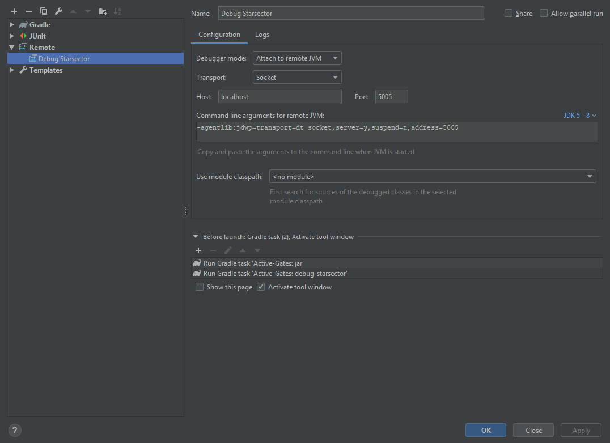

# Starsector Mod Template using Gradle and IntelliJ

## Description

This is a template for a Starsector mod that uses Gradle as its build system, Kotlin as the Gradle DSL, and Kotlin as the programming language.

It will also have a one-click command to build your mod and launch Starsector with full breakpoint debugging.

One of the main goals is to move as much of the build process out of IntelliJ as possible, so that anybody can pull down the source code and build the project with minimal hassle. IntelliJ is not required to build the mod.

Another goal is to have more project configuration as code, rather than IDE-specific files. That way, they'll get versioned (and be shared, as mentioned).

Written for IntelliJ Community. Latest version is 2021.1 as of writing.

## Initial Setup Checklist

- [ ] Open `build.gradle.kts` and update all values in the `CHANGE ME` at the top.
- [ ] Change the package from the template default. In IntelliJ, open up `src/main/kotlin/com/example/template`, right-click on the first line (`package com.example.template`) and go to `Refactor - Rename`. From there, you may rename `com.example.template` to anything. If it pops up a refactoring preview, keep everything selected and click `Do Refactor`. 
- [ ] In `settings.gradle`, change `rootProject.name = 'template'` to be equal to your new name instead (the rename we just did should have already done that).
  
### Optional

- Rename your version file to work with [Version Checker](http://fractalsoftworks.com/forum/index.php?topic=8181.0)
  - [ ] `template.version`: change "template" to the unique name of your mod (eg "myMod.version")
  - [ ] `data/config/version/version_files.csv`: open and change "template.version" to the name of the file you just changed ("eg "myMod.version").
  - [ ] Update your version file (`template.version`) to use data for your mod.
- Change `LICENSE` to something else. [Apache 2](https://tldrlegal.com/license/apache-license-2.0-(apache-2.0)) is a popular one.

## IntelliJ Configuration

### Ensure that your run configuration is correct:

- In IntelliJ, click `Run - Edit Configurations`.
- Select "Run Starsector"
- [ ] Set Working directory to the location of your `starsector-core` folder, if different than what's currently there.
- [ ] Check other values to make sure they fit your Starsector install. By default, they are set for a typical Windows install.
- Click Ok. You should now be able to choose Run Starsector from the Run menu and then click the Debug button (the icon of a bug) 
- Don't forget to enable your mod on the Starsector launch dialog!

*Example for this template*

## Other

Author: Wispborne (Wisp#0302 on the Unofficial Starsector Discord)

License: [Unlicense](https://github.com/davidwhitman/starsector-mod-template/blob/master/LICENSE)
